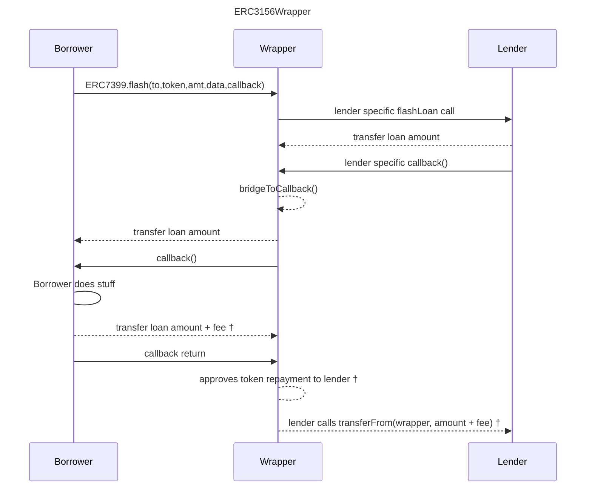

# ERC7399 Flash Lender Wrappers

This repository contains contracts that work as
[ERC7399](https://github.com/ethereum/EIPs/blob/d072207e24e3cc12b6315909e6a65275a38e1984/EIPS/eip-7399.md) entry points
for popular flash lenders.

## How Do These Wrappers Work



† For the BalancerWrapper and Uniswap v3 the borrower transfers the repayment to the lender and the wrapper skips the
repayment approval.

## Addresses

Contracts are deployed at the same address for all supported networks.

| Contract                                               | Lender      | Address                                    | Networks               |
| ------------------------------------------------------ | ----------- | ------------------------------------------ | ---------------------- |
| [AaveWrapper](src/aave/AaveWrapper.sol)                | Aave v3     | 0x02C7632b84B3447845531541d0285D67E656e50c | Arbitrum One, Optimism |
| [BalancerWrapper](src/balancer/BalancerWrapper.sol)    | Balancer v2 | 0x3d4DF8596e5750A4F721c8764d585dcc8623d009 | Arbitrum One, Optimism |
| [UniswapV3Wrapper](src/uniswapV3/UniswapV3Wrapper.sol) | Uniswap v3  | 0x23de8e0bB91A105bEFf9d40d8d75C1A9fE40f523 | Arbitrum One, Optimism |

When a contract requires constructor parameters which vary per network, these are supplied by the
[Registry](https://github.com/alcueca/registry) deployed at 0x05caE14d1A348B29d2b169697b4BE51009a9C4dF in each supported
network.

## Flash Loans

For detail on executing flash loans, please refer to the
[ERC7399](https://github.com/ethereum/EIPs/blob/d072207e24e3cc12b6315909e6a65275a38e1984/EIPS/eip-7399.md) EIP.

## Using This Repository

This is a list of the most frequently needed commands.

### Build

Build the contracts:

```sh
$ forge build
```

### Clean

Delete the build artifacts and cache directories:

```sh
$ forge clean
```

### Compile

Compile the contracts:

```sh
$ forge build
```

### Coverage

Get a test coverage report:

```sh
$ forge coverage
```

### Deploy

Deploy to Anvil:

```sh
$ forge script script/Deploy.s.sol --broadcast --fork-url http://localhost:8545
```

For this script to work, you need to have a `MNEMONIC` environment variable set to a valid
[BIP39 mnemonic](https://iancoleman.io/bip39/).

For instructions on how to deploy to a testnet or mainnet, check out the
[Solidity Scripting](https://book.getfoundry.sh/tutorials/solidity-scripting.html) tutorial.

### Format

Format the contracts:

```sh
$ forge fmt
```

### Gas Usage

Get a gas report:

```sh
$ forge test --gas-report
```

### Lint

Lint the contracts:

```sh
$ pnpm lint
```

### Test

Run the tests:

```sh
$ forge test
```

## Notes

1. Foundry uses [git submodules](https://git-scm.com/book/en/v2/Git-Tools-Submodules) to manage dependencies. For
   detailed instructions on working with dependencies, please refer to the
   [guide](https://book.getfoundry.sh/projects/dependencies.html) in the book
2. You don't have to create a `.env` file, but filling in the environment variables may be useful when debugging and
   testing against a fork.

## License

This project is licensed under MIT.
