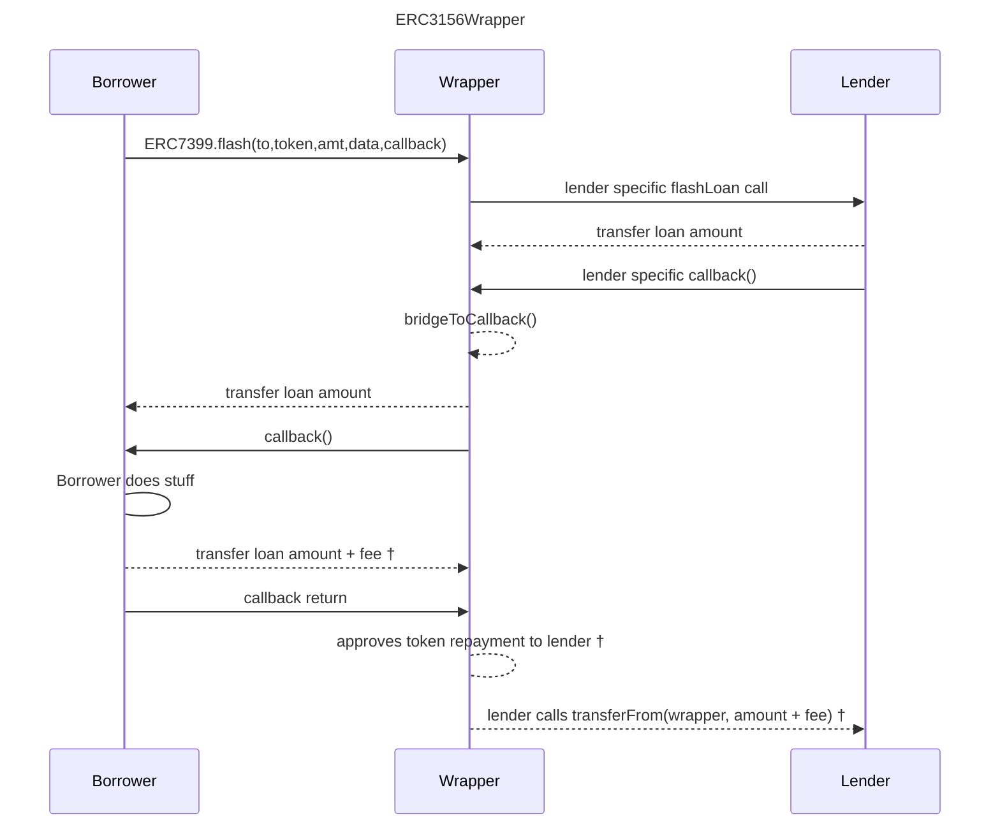

# ERC7399 Flash Lender Wrappers

This repository contains contracts that work as [ERC7399](https://github.com/ethereum/ERCs/blob/master/ERCS/erc-7399.md)
entry points for popular flash lenders.

## How Do These Wrappers Work



† For the BalancerWrapper and Uniswap v3 the borrower transfers the repayment to the lender and the wrapper skips the
repayment approval.

## Deployments

| Lender                 | Address                                    | Networks                                          | Gas     | Fees     | Contract                                                        |
| ---------------------- | ------------------------------------------ | ------------------------------------------------- | ------- | -------- | --------------------------------------------------------------- |
| Aave v3                | 0x9D4D2C08b29A2Db1c614483cd8971734BFDCC9F2 | Arbitrum One, Optimism, Polygon                   | 212569  | 0.05%    | [AaveWrapper](src/aave/AaveWrapper.sol)                         |
| Aave v3 (Permissioned) | 0x0c86c636ed5593705b5675d370c831972C787841 | Ethereum, Gnosis                                  | 229742  | 0        | [AaveWrapper](src/aave/AaveWrapper.sol)                         |
| Spark                  | 0x8cB701df93f2Dae295aE8D7beE5Aa7e4D40CB397 | Ethereum, Gnosis                                  | 212569  | 0        | [AaveWrapper](src/aave/AaveWrapper.sol)                         |
| ZeroLend               | 0xA48Cc0e4159C51d73B42c824f1444D1C1cbdA531 | Ethereum                                          | 212569  | 0        | [AaveWrapper](src/aave/AaveWrapper.sol)                         |
| Balancer v2            | 0x9E092cb431e5F1aa70e47e052773711d2Ba4917E | Ethereum, Arbitrum One, Optimism, Polygon, Gnosis | 113032  | 0        | [BalancerWrapper](src/balancer/BalancerWrapper.sol)             |
| Balancer v2            | 0xD534400B0555F8441c5a3e0E9e585615B54fB2F4 | Base                                              | 113032  | 0        | [BalancerWrapper](src/balancer/BalancerWrapper.sol)             |
| Uniswap v3             | 0x319300462C37AD2D4f26B584C2b67De51F51f289 | Arbitrum One, Optimism, Polygon, Ethereum         | 94720   | Variable | [UniswapV3Wrapper](src/uniswapV3/UniswapV3Wrapper.sol)          |
| Balancer + Moonwell    | 0x6207ec38da68902CC60D3760c9fe3EB64B426207 | Base                                              | 1183309 | 0        | [CompoundWrapper](src/compound/CompoundWrapper.sol)             |
| Balancer + Sonne       | 0x6412183C579a276f467ad38468D19CC8f1F2b5cb | Optimism                                          | 1040313 | 0        | [CompoundWrapper](src/compound/CompoundWrapper.sol)             |
| Balancer + Silo        | 0x0F9104Fec1a5C91e63632E215e8F5c57C8f32c77 | Arbitrum One                                      | 1025824 | 1        | [SiloWrapper](src/silo/SiloWrapper.sol)                         |
| Dolomite               | 0x54F1ce5E6bdf027C9a6016C9F52fC5A445b77ed6 | Arbitrum One                                      | 459815  | 0        | [DolomiteWrapper](src/dolomite/DolomiteWrapper.sol)             |
| MorphoBlue             | 0xa0Cb4e1222d813D6e4dE79f2A7A0B7759209588F | Ethereum                                          | 132114  | 0        | [MorphoBlueWrapper](src/morpho/MorphoBlueWrapper.sol)           |
| Camelot                | 0x5E8820B2832aD8451f65Fa2CCe2F3Cef29016D0d | Arbitrum One                                      | 80679   | 0.01%    | [AlgebraWrapper](src/algebra/AlgebraWrapper.sol)                |
| Camelot + Pendle       | 0xC9d66F655b7B35A2B4958bE2FB58E472736Bbc47 | Arbitrum One                                      | 506792  | 0.01%    | [AlgebraPendleWrapper](src/pendle/AlgebraPendleWrapper.sol)     |
| Balancer + Pendle      | 0xC1Ea6a6df39D991006b39706db7C51f5A1819da7 | Arbitrum One                                      | 525422  | 0        | [BalancerPendleWrapper](src/pendle/BalancerPendleWrapper.sol)   |
| Uniswap v3 + Pendle    | 0xa353Fd50210786F0E038ddD574A21d0CCefb3163 | Arbitrum One                                      | 497567  | Variable | [UniswapV3PendleWrapper](src/pendle/UniswapV3PendleWrapper.sol) |
| Aerodrome              | 0x69b6E55f00d908018E2D745c524995bc231D762b | Base                                              | 163919  | Variable | [SolidlyWrapper](src/solidly/SolidlyWrapper.sol)                |
| Velodrome              | 0xcF13CDdbA3aEf757c52466deC310F221e06238d6 | Optimism                                          | 163919  | Variable | [SolidlyWrapper](src/solidly/SolidlyWrapper.sol)                |

Disclaimer: The gas costs are calculated for calling `flashLoan` on each wrapper for an arbitrarily chosen token and
loan amount. Calling the underlying flash lender directly may have larger gas savings in some instances than others.
Requesting loans for different tokens or amounts might have different gas costs. For AMMs the fees often vary according
to pool parameters and state.

## Gnosis Safe Wrapper

The [Gnosis Safe Wrapper](src/gnosissafe/GnosisSafeWrapper.sol) is intended for individual users to flash lend their own
assets held in a Gnosis Safe and earn a fee. To enable it, from your own Gnosis Safe, execute a transaction bundle to
enable the GnosisSafeWrapperFactory and set the fees for individual assets.

```
safe.enableModule(gnosisSafeWrapperFactory);
gnosisSafeWrapperFactory.lend(asset, fee);
...
```

or an override to lend all assets in the safe:

```
safe.enableModule(gnosisSafeWrapperFactory);
gnosisSafeWrapperFactory.lendAll(fee);
...
```

The `fee` parameter can be zero for free flash loans. To disable lending, execute from your safe the following command:

```
gnosisSafeWrapperFactory.disableLend(asset);
...
```

If you set a lending override, you can disable it to go back to individual asset configuration:

```
gnosisSafeWrapperFactory.disableLendAll();
...
```

## Gnosis Safe Wrapper

The [Gnosis Safe Wrapper](src/gnosissafe/GnosisSafeWrapper.sol) is intended for individual users to flash lend their own
assets held in a Gnosis Safe and earn a fee. To enable it, from your own Gnosis Safe, execute a transaction bundle to
enable the GnosisSafeWrapperFactory and set the fees for individual assets.

```
safe.enableModule(gnosisSafeWrapperFactory);
gnosisSafeWrapperFactory.lend(asset, fee);
...
```

or an override to lend all assets in the safe:

```
safe.enableModule(gnosisSafeWrapperFactory);
gnosisSafeWrapperFactory.lendAll(fee);
...
```

The `fee` parameter can be zero for free flash loans. To disable lending, execute from your safe the following command:

```
gnosisSafeWrapperFactory.disableLend(asset);
...
```

If you set a lending override, you can disable it to go back to individual asset configuration:

```
gnosisSafeWrapperFactory.disableLendAll();
...
```

## Flash Loans

For detail on executing flash loans, please refer to the
[ERC7399](https://github.com/ethereum/ERCs/blob/master/ERCS/erc-7399.md) EIP.

## Safety

This is **experimental software** and is provided on an "as is" and "as available" basis.

While care has been taken during development, and most contracts have seen significant use, **we do not give any
warranties** and **will not be liable for any loss** incurred through any use of this codebase.

## Using This Repository

This is a list of the most frequently needed commands.

### Build

Build the contracts:

```sh
$ forge build
```

### Clean

Delete the build artifacts and cache directories:

```sh
$ forge clean
```

### Compile

Compile the contracts:

```sh
$ forge build
```

### Coverage

Get a test coverage report:

```sh
$ forge coverage
```

### Deploy

Deploy to Anvil:

```sh
$ forge script script/Deploy.s.sol --broadcast --fork-url http://localhost:8545
```

For this script to work, you need to have a `MNEMONIC` environment variable set to a valid
[BIP39 mnemonic](https://iancoleman.io/bip39/).

For instructions on how to deploy to a testnet or mainnet, check out the
[Solidity Scripting](https://book.getfoundry.sh/tutorials/solidity-scripting.html) tutorial.

### Format

Format the contracts:

```sh
$ forge fmt
```

### Gas Usage

Get a gas report:

```sh
$ forge test --gas-report
```

### Lint

Lint the contracts:

```sh
$ pnpm lint
```

### Test

Run the tests:

```sh
$ forge test
```

## Notes

1. Foundry uses [git submodules](https://git-scm.com/book/en/v2/Git-Tools-Submodules) to manage dependencies. For
   detailed instructions on working with dependencies, please refer to the
   [guide](https://book.getfoundry.sh/projects/dependencies.html) in the book
2. You don't have to create a `.env` file, but filling in the environment variables may be useful when debugging and
   testing against a fork.

## License

This project is licensed under MIT.
